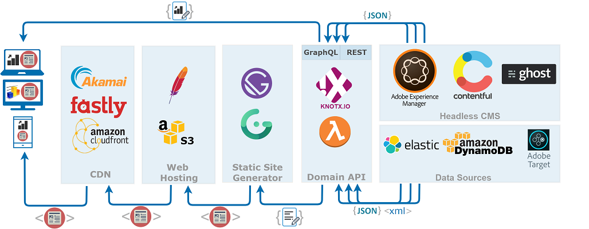

[![][license img]][license]
[![][central-repo img]][central-repo]
[![][gitter img]][gitter]

> If you are directed here from https://github.com/Cognifide/knotx or you are looking for 
Knot.x 1.X version please see this repository Tags, the latest 1.5.0 version code is available 
[here](https://github.com/Knotx/knotx/tree/1.5.0) along with the 
[documentation](https://github.com/Knotx/knotx/tree/1.5.0/documentation/src/main/wiki).

  

http://knotx.io

  web integration framework

Knot.x is an open source framework integrating content from different sources like headless or 
traditional CMS, with systems like CRM, e-commerce or search engines.

The heart of Knot.x is the [HTTP Server](https://github.com/Knotx/knotx-server-http) that uses 
[Fragment Processing](https://github.com/Knotx/knotx-fragments-handler) to connect many data sources
into one customer experience (like HTML, JSON or PDF) in the configurable, reactive, scalable and fault-tolerant way.

A fragment is a piece of any kind of document that can be processed independently (e.g. 
an HTML snippet that represents the shopping cart or a JSON containing person's bookshelf).

Knot.x comes also with a [distribution](https://github.com/Knotx/knotx-stack) that enables quick start
with the framework, is a project structure and supports deployment automation (see the 
[Cookbook](https://github.com/Knotx/knotx-cookbook) and [Docker images](https://hub.docker.com/u/knotx)).

We build Knot.x on top of [Vert.x](http://vertx.io/), known as one of the leading toolkits for performant,
event-driven applications. It uses asynchronous programming principles which allows it to process a
large number of requests using a single thread. Asynchronous programming is a style promoting the
ability to write non-blocking code (no thread pools). The platform stays responsive under heavy and
varying load and is designed to follow [Reactive Manifesto](http://www.reactivemanifesto.org/) principles.

> Knot.x 2.0 development is in progress... 
> So far you may enjoy [Knot.x 2.0.0-RC1](https://search.maven.org/search?q=g:io.knotx%20AND%20v:2.0.0-RC1).

## Use cases

### Headless CMS
// TODO add description here

// TODO other use-cases: traditional CMS, Gateway API

## How to start

See [knotx.io](http://knotx.io/tutorials) for tutorials and examples.
See [Knot.x Example Project](https://github.com/Knotx/knotx-example-project) for usage case examples.
See https://github.com/Knotx extensions for user and developer documentation.

For more information on Knot.x and where Knot.x fits into the big picture please see http://knotx.io.

## Community / Issues

All feature requests and bugs can be filed as issues on [GitHub](https://github.com/Cognifide/knotx/issues).
Do not use Github issues to ask questions, post them on the
[User Group](https://groups.google.com/forum/#!forum/knotx) or [Gitter Chat](https://gitter.im/Knotx/Lobby).

## License

**Knot.x** is licensed under the [Apache License, Version 2.0 (the "License")](https://www.apache.org/licenses/LICENSE-2.0.txt)

[license]:https://github.com/Knotx/knotx/blob/master/LICENSE
[license img]:https://img.shields.io/badge/License-Apache%202.0-blue.svg

[central-repo]:http://search.maven.org/#search%7Cga%7C1%7Cg%3A%22io.knotx%22
[central-repo img]:https://img.shields.io/maven-central/v/io.knotx/knotx-root.svg?label=Maven%20Central

[gitter]:https://gitter.im/Knotx/Lobby
[gitter img]:https://badges.gitter.im/Knotx/knotx-extensions.svg
